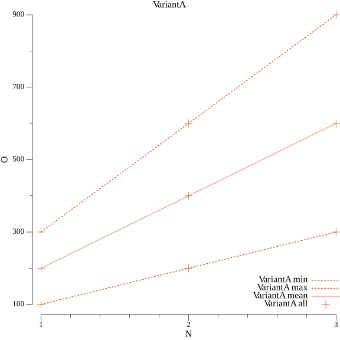

# Big-O Run & Plot
> Library that helps to run Big-O Experiments and plot the output

[](https://goreportcard.com/report/github.com/Oppodelldog/bigo)
[](https://godoc.org/github.com/Oppodelldog/bigo)
[](https://raw.githubusercontent.com/Oppodelldog/bigo/master/LICENSE)

## Example comparing two variants
[examples/ex1/main.go](examples/ex1/main.go)
```go
package main

import (
	"time"

	"github.com/Oppodelldog/bigo"
)

func main() {
	for testName, testRunner := range map[string]Runner{
		"VariantA": {Sleep: 100},
		"VariantB": {Sleep: 200},
	} {
		bigo.
			New(
				testName,
				testRunner,
				bigo.NewArrayStepper([]float64{1, 2, 3}),
			).
			Run().
			WriteResultsToJson().
			PlotResults()
	}
}

// Runner implements TestRunner
type Runner struct {
	Sleep int
}

// Step simulated to test some logic. For simplicity it simply waits N*r.Sleep milliseconds.
func (r Runner) Step(n float64) bigo.OMeasures {
	timeStart := time.Now()

	// TODO: put your code under test here
	time.Sleep(time.Millisecond * time.Duration(r.Sleep) * time.Duration(n))

	return bigo.OMeasures{{O: float64(time.Since(timeStart).Milliseconds())}}
}
```

Variant A           |  Variant B
:-------------------------:|:-------------------------:
  |  

## Example extended capturing, N-2d
Let's assume you want to test every N with another subset of test values.  
For example **N** would represent the number of Records in your database.  
Now you want to test how your algorithm reacts on different user inputs.  
This is why **Step** returns a list of measures **bigo.OMeasures**.  
This allows to capture multiple Os for every **N**.    
The plot the will reflect that in **min, max, mean, all**  

**Here's a sample**
[examples/ex2/main.go](examples/ex2/main.go)

 ```go
// Step simulated 3 additional scales to the given N. In this case
func (r Runner) Step(n float64) bigo.OMeasures {
	var measures bigo.OMeasures
	for i := 1; i <= 3; i++ {
		timeStart := time.Now()
		time.Sleep(time.Millisecond * time.Duration(r.Sleep) * time.Duration(n) * time.Duration(i*r.Factor))
		measures = append(measures, bigo.OMeasure{O: float64(time.Since(timeStart).Milliseconds())})
	}

	return measures
}

 ```
 
 Variant A           |  Variant B
:-------------------------:|:-------------------------:
  |  
